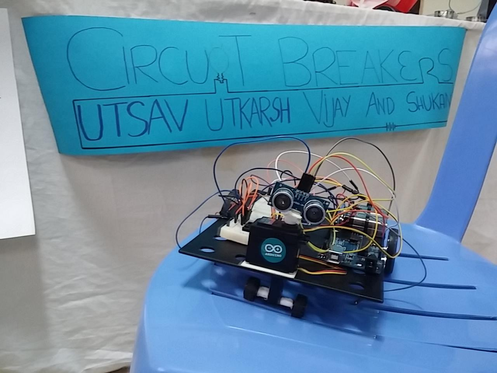

# Obstacle Tackling Autonomous Robot

This is a program that provides instructions to my autonommous robot made using Arduino as its microcontroller. You can also watch a small [video clip](https://vimeo.com/225901429) of the robot.
## Software Requirements
* Arduino IDE ([Download link](https://www.arduino.cc/en/Main/Software))
* Servo Library (Present by default with Arduino IDE)
* NewPing Library ([Download link](http://playground.arduino.cc/Code/NewPing))
## Components
* Arduino (microcontroller)
* DC motor [x2]
* Servo motor
* IR Sensor
* Motor driver
* Chassis
* Wheel (powered by the above DC motors) [x2]
* Caster wheel
## Build
* The two DC motors are fit below the chassis and two wheels are connected to each of the two motors.
* The breadboard is fit on top of the chassis and is primarily used to make connections. The motor driver is fit onto the breadboard.
* The servo motor is also fit onto the chassis and the IR sensor is fit onto this motor. This servo is what helps turn the IR sensor left and right so that the sensor can calculate distances and choose the direction with the longer distance, as you will see in the working.
* Arduino and batteries are also fit onto the chassis.
* A supporting caster wheel is also fit below the chassis, right below the servo.
## Working
1. Initially the setup function gets executed which initializes all components of the robots.
2. After setup gets executed, the loop function is called.
3. In the loop function, first the servo checks if the distance ahead from the object ahead is less than the 35, if true the findroute function gets executed else the forward function gets executed.
4. The forward function simply powers the motors to run in the same direction forwards.
5. The findroute function does 4 things; halt, move back, turn the servo left to calculate distance using IR and then turn right to calculate distance again using IR.
6. How turning occurs is by causing both the wheels to turn in opposite directions.
7. If object distance on the left is more than object distance on the right, the bot turns left, else it turns right.
8. Once either forward or findroute functions are executed the loop function is called again and the same above procedure takes place. This goes on until the robot is turned off.
